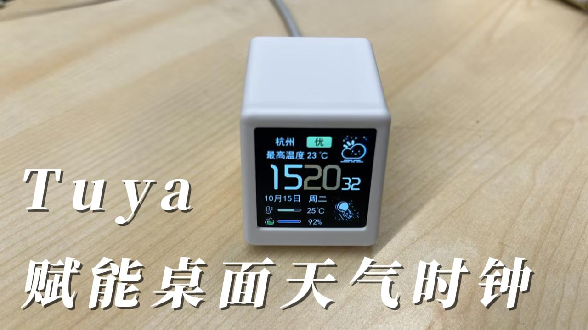
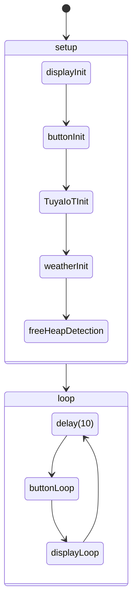

# TuyaDesktopDisplay

## 概述

该项目是基于 chuxin520922 的 [SmallDesktopDisplay](https://github.com/chuxin520922/SmallDesktopDisplay/tree/main) 项目进行的二次开发，使用的模组是 [Tuya T2 模组](https://developer.tuya.com/cn/docs/iot/T2-U-module-datasheet?id=Kce1tncb80ldq) 。

主要功能是显示用户配网时的位置的天气信息和时间信息。项目成品图如下：



演示视频如下：

<video src="https://images.tuyacn.com/rms-static/06f755a0-95d5-11ef-9ccb-47cdb7db279b-1730192764922.mp4?tyName=%E6%B6%82%E9%B8%A6%E6%A1%8C%E9%9D%A2%E5%A4%A9%E6%B0%94%E6%97%B6%E9%92%9F4.mp4"></video>

## 原理

### 硬件

硬件已经在嘉立创开源广场开源，[点击查看](https://oshwhub.com/yangyangyan/tuyadesktopdisplay)。

在硬件上可以分为 4 部分：

+ 主控模块，T2
+ 电源部分使用 TYPE-C 供电，使用 AMS1117-3.3 稳压器将输入电压稳定为 3.3V 的输出电压。
+ 串口芯片使用的是 CH340C
+ 屏幕使用的是 1.54 寸的 ST7789 SPI TFT

外壳使用的是 [SmallDesktopDisplay](https://github.com/chuxin520922/SmallDesktopDisplay) 中的 4.3D Model/SD2

### 软件

程序流程图如下：



TuyaIoTInit 在初始化之后会创建一个新的线程，TuyaIoT 相关的功能都会在这个新线程中进行执行。

weatherInit 则是在 opensdk 中的工作队列中进行执行的，由于工作队列的初始化是在 TuyaIoTInit 中进行初始化的，所以 weatherInit 需要在 TuyaIoTInit 之后调用。

由于 T2 资源有限，还有支持 OTA 功能，所以需要将一部分数据（天气图片）存放到文件系统中，也就是 2.Tools/weatherImgWrite 工程。如果不烧录该工程会导致天气图片显示不正常。

## 产品实现

1. 软件的开发环境使用的是 Arduino IDE 2 进行开发，关于开发环境的搭建可以参考 [arduino-tuyaopen](https://github.com/tuya/arduino-tuyaopen) 。

2. 将 `1.Software/libraries` 复制到 Arduino 库目录 。`libraries` 中的库文件作用如下：

   1. OneButton，一个按键驱动库，[点击查看 GitHub 仓库](https://github.com/mathertel/OneButton)。

   2. TFT_eSPI， SPI 屏幕驱动库。原仓库为 [TFT_eSPI](https://github.com/Bodmer/TFT_eSPI)，在 t2 上使用该库需要进行一些修改，主要是在 Processors 中新增 T2 驱动，User_Setups 中新增 Setup303_Tuya_T2_ST7789.h 文件，修改 User_Setup_Select.h 文件，选择 T2 ST7789 驱动文件。注意需要配合最新版的 Tuya Open 使用

   3. TJpg_Decoder，图片解码库。原仓库为 [TJpg_Decoder](https://github.com/Bodmer/TJpg_Decoder)。由于 T2 暂不支持 SD library，所以需要注释掉 TJpg_Decoder/src/User_Config.h 中的 

      ```c
      // #define TJPGD_LOAD_SD_LIBRARY
      ```

3.  由于 T2 资源有限，所以部分图片资源存放在文件系统中。在编译烧录之前需要先向 FS 中写入天气图片，操作步骤如下([点击下载烧录工具](https://images.tuyacn.com/rms-static/53e80a50-0a88-11ee-bee7-5de1c3a84f6c-1686729113461.zip?tyName=bk_writer_gui_V1.7.5.zip))：

   1. 擦除应用代码区域，防止当前应用代码有文件系统操作功能。擦除开始地址：`0x11000`，长度: `0x119000`
   2. 擦除文件系统区域，***该操作会擦除开发板内部的授权信息，导致激活信息丢失！！！*** 擦除开始地址：`0x1d2000`，长度: `0x2e000`
   3. 烧录天气文件写入程序，`2.Tools/weatherImgWrite/weatherImgWrite.ino`

4. `1.Software/tuyaDesktopDisplay` 为该项目的源代码。目录结构和功能模块介绍如下：

   + font 文件夹为存放字体的文件夹

     + W3660 为 小时 字体
     + O3660 为 分钟 字体
     + W1830 为 秒 字体
     + simhei20.h 为除上面外所有字体（主要为中文字体）

     + image 文件夹为图片文件夹
       + humidity 为湿度图标图片
       + temperature 为温度图标图片
       + pangzi 文件夹内为太空人图片

   + tuyaDesktopDisplay.ino 为项目入口文件

   + app_button 为按键驱动文件

   + app_display 为显示功能文件

   + app_tuya_iot 为 Tuya IoT 功能文件

   + app_weather 为天气功能文件

   + number 为数字时钟功能文件

   + weathernum 为天气图片功能文件

   编译烧录 tuyaDesktopDisplay 项目，**注意修改代码中的授权信息**。

5. `3.docs` 中还放了关于屏幕的文档介绍。